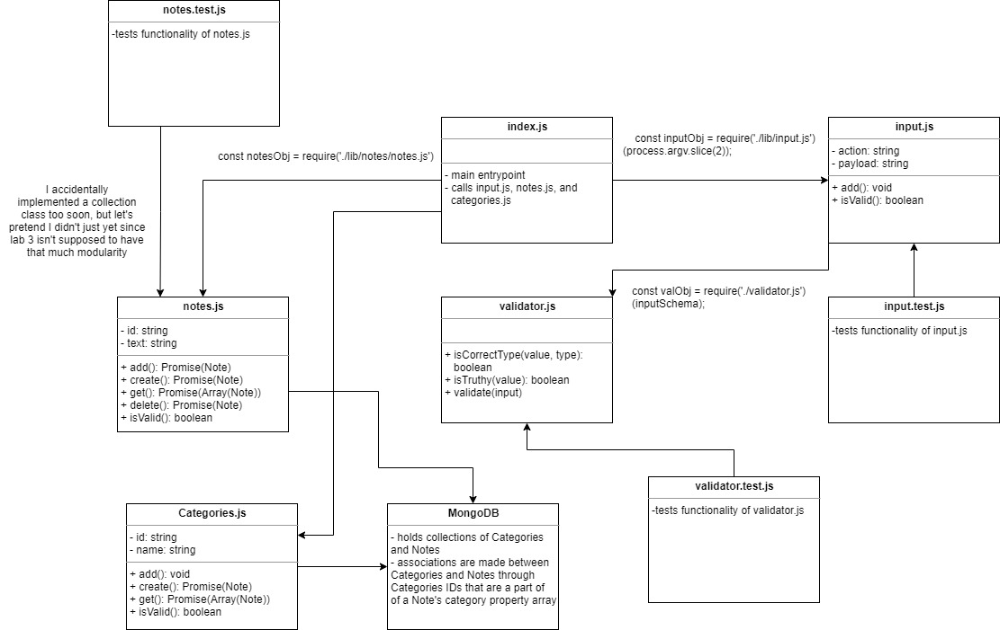

# LAB - Data Modeling & NoSQL Databases (03)

## Rev 03: CRD (that's right, no update yet) with Notes and CR with Categories

### Author: Earl Jay Caoile

### Links and Resources

- [submission PR](https://github.com/earljay-caoile-401-advanced-javascript/notes/pull/3)
- [GitHub Actions](https://github.com/earljay-caoile-401-advanced-javascript/notes/actions)
- [npm package](https://www.npmjs.com/package/@unfie555/notes)

#### Documentation

- [how to publish packages](https://zellwk.com/blog/publish-to-npm/)
- [minimist GitHub repo](https://github.com/substack/minimist)
- [JSDoc Official Documentation](https://jsdoc.app/about-getting-started.html)
- [Jest Documentation](https://jestjs.io/docs/en/configuration)
- [mongoose close connection](https://stackoverflow.com/questions/15999999/mongoose-close-connection/16000730#16000730)
- [Why we need toJSON when comparing to two components equality?](https://stackoverflow.com/questions/47361668/why-we-need-tojson-when-comparing-to-two-components-equality)

### Setup

To run locally, run `npm i` from the root directory.
To install the package from npm, run `npm i @unfie555/notes` from the root directory.

#### Configuring MongoDB

- create an .env file on the top level of this repo defining the following variables:
```
MONGODB_URI=mongodb://localhost:27017/notes
PORT=3000
```
- start your database with the path of the DB along with the folder location for your DB files (`mongod --dbpath=/Users/path/to/data/db`: i.e. `"C:\Program Files\MongoDB\Server\4.2\bin\mongod.exe" --dbpath="D:\db"` on Windows)

### How to use package

Once the package is installed through npm or ran locally through the repo, users can enter the following commands:

When a user adds a new note, it is saved to the database
- `notes -add “This is fun” –category school`

Users can list notes from the database
- All Notes: `notes --list` or `notes -l`
- Notes in a category: `notes --list school` or `notes -l school`

Users can delete a single note
- `notes -d insertIDhere555`

#### Tests

- Testing command: `npm test` from the root directory.

#### UML

