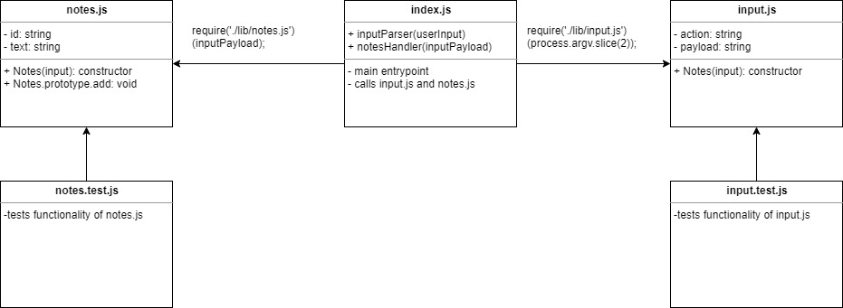

# LAB - Node Ecosystem (01)

## A Half-Hearted Attempt at TDD

### Author: Earl Jay Caoile

### Links and Resources

- [submission PR](https://github.com/earljay-caoile-401-advanced-javascript/notes/pull/1)
- [GitHub Actions](https://github.com/earljay-caoile-401-advanced-javascript/notes/actions)
- [npm package](https://www.npmjs.com/package/@unfie555/notes)

#### Documentation

- [how to publish packages](https://zellwk.com/blog/publish-to-npm/)
- [minimist GitHub repo](https://github.com/substack/minimist)

### Setup

To run locally, run `npm i` from the root directory.
To install the package from npm, run `npm i @unfie555/notes` from the root directory.

#### Tests

- Testing command: `npm test` from the root directory 

#### UML

