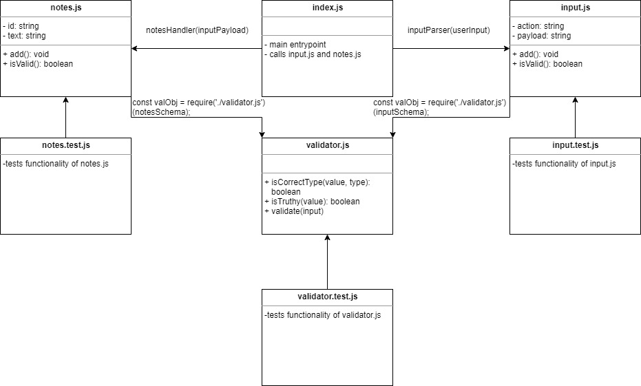

# LAB - Classes, Inheritance, Functional Programming (02)

## Notes - Rev 02: Taking your notes and spitting them back out to you!

### Author: Earl Jay Caoile

### Links and Resources

- [submission PR](https://github.com/earljay-caoile-401-advanced-javascript/notes/pull/2)
- [GitHub Actions](https://github.com/earljay-caoile-401-advanced-javascript/notes/actions)
- [npm package](https://www.npmjs.com/package/@unfie555/notes)

#### Documentation

- [how to publish packages](https://zellwk.com/blog/publish-to-npm/)
- [minimist GitHub repo](https://github.com/substack/minimist)
- [JSDoc Official Documentation](https://jsdoc.app/about-getting-started.html)
- [Jest Documentation](https://jestjs.io/docs/en/configuration)

### Setup

To run locally, run `npm i` from the root directory.
To install the package from npm, run `npm i @unfie555/notes` from the root directory.

### How to use package

Once the package is installed through npm or ran locally through the repo, enter commands using the following formats: `notes -a 'blah blah blah'` or `notes -add 'blah blah blah'`. You should see a console log saying something like `adding the following: blah blah blah`

At this time, only the -a or -add flag works. Any other flags will return an exception. Leaving the string argument empty will also result in an exception.

#### Tests

- Testing command: `npm test` from the root directory.

#### UML

